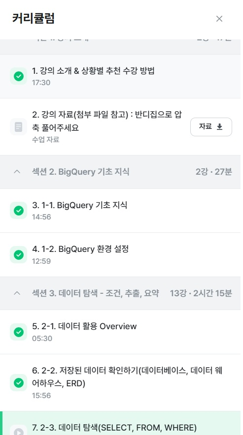

# SQL_BASIC 1주차 정규 과제 

📌SQL_BASIC 정규과제는 매주 정해진 분량의 `초보자를 위한 BigQuery(SQL) 입문` 강의를 듣고 간단한 문제를 풀면서 학습하는 것입니다. 이번주는 아래의 **SQL_Basic_1st_TIL**에 나열된 분량을 수강하고 `학습 목표`에 맞게 공부하시면 됩니다.

**1주차 과제**에서는 수강한 내용을 모두 요약 정리하기보다는, **SQL이 왜 필요한지에 대해 배우고 느낀 점, 그리고 강의를 듣고 본인이 원하는 목표를 중심으로 작성**하여 과제 업로드 시트에 깃허브 링크를 스프레드시트 'SQL' 시트에 붙여서 넣어주세요. 

**👀(수행 인증샷은 필수입니다.)** 

## SQL_BASIC_1st_TIL

### 섹션 2. BigQuery 기초 지식

### 1-1. BigQuery 기초 지식

### 1-2. BigQuery 환경 설정

## 섹션 3. 데이터 탐색 - 조건, 추출, 요약

### 2-1. 데이터 활용 Overview 

### 2-2. 저장된 데이터 확인하기

## 🏁 강의 수강 (Study Schedule)

| 주차  | 공부 범위              | 완료 여부 |
| ----- | ---------------------- | --------- |
| 1주차 | 섹션 **1-1** ~ **2-2** | ✅         |
| 2주차 | 섹션 **2-3** ~ **2-5** | 🍽️         |
| 3주차 | 섹션 **2-6** ~ **3-3** | 🍽️         |
| 4주차 | 섹션 **3-4** ~ **4-4** | 🍽️         |
| 5주차 | 섹션 **4-4** ~ **4-9** | 🍽️         |
| 6주차 | 섹션 **5-1** ~ **5-7** | 🍽️         |
| 7주차 | 섹션 **6-1** ~ **6-6** | 🍽️         |

 

<!-- 여기까진 그대로 둬 주세요-->

---

# 1️⃣ 개념정리 
<!-- 강의 수강 이후에 아래의 학습 목표에 맞게 개념을 자유롭게 정리해주세요.-->
## 1-1. BigQuery 기본지식

~~~
✅ 학습 목표 :
* 데이터 관련 기초 지식(OLTP, SQL, Row, Column, 저장 형태 등)을 설명할 수 있다. 
* BigQuery 관련 기초 지식에 대해서 파악할 수 있다. 
~~~

<!-- 새롭게 배운 내용을 자유롭게 정리해주세요.-->
google cloud에서 big query를 사용한다
구성요소는 프로젝트>데이터셋>테이블 순이다
건물>창고>선반으로 비유해서 생각할 수 있다
1열이 헤더라면 건너뛸 헤더행1 넣어주기
파티션이 있다면 아이콘이 나뉜모양임

## 2-1. 데이터 활용 Overview

~~~
✅ 학습 목표 :
* 데이터를 활용하는 과정을 설명할 수 있다.
* 데이터를 탐색하는 과정으로 조건과 추출, 요약을 할 수 있다. 
~~~

<!-- 새롭게 배운 내용을 자유롭게 정리해주세요.-->
SQL의 기본문법은 SELECT, FROM, WHERE임

## 2-2. 저장된 데이터 활용하기

~~~
✅ 학습 목표 :
* 데이터가 저장되는 형태를 알고 저장된 데이터를 활용할 수 있다. 
~~~

<!-- 새롭게 배운 내용을 자유롭게 정리해주세요.-->
데이터가 어떻게 저장되어있는가?를 먼저 확인해줘야함
어떤데이터가 어떻게 저장되어있고 컬럼의 의미가 무엇인지 확인한다
해당 열의 값들이 올바른지, 어떤 범주로 묶여있는지 등 데이터에따라 다양한 부분을 확인한다
ERD를 확인한다
테이블, 컬럼확인, 테이블간의 연결관계 확인
---
# 2️⃣ 학습 인증란
<!-- 이 글을 지우고, 여기에 학습한 것을 인증해주세요.-->

 
 

---

# 3️⃣ 확인문제

## 문제 1

> **🧚Q. 포켓몬 게임이나 이커머스 산업과 같이 다양한 산업에서는 각기 다른 데이터가 존재합니다. 다음 중 하나의 산업을 선택하고, 해당 산업에서 수집하고 활용될 수 있는 데이터 항목 (칼럼) 5가지를 자유롭게 상상하여 나열해보세요.**
>
> - 예시 산업 
>
> >  온라인 음식 배달 / 스마트 헬스 케어 / 중고 거래 앱 / 교육 플랫폼 등 

<!--현실과 데이터 분석의 연결 고리를 상상하고, 데이터를 저장하는 형태를 활용하는 문제입니다. -->

<!--학습한 개념을 활용하여 자유롭게 설명해 보세요. 구체적인 예시를 들어 설명하면 더욱 좋습니다.-->

~~~
온라인 음식 배달
1. 고객 ID 2. 음식카테고리 3. 배달 상태 4. 가격 5.별점
~~~

## 문제 2

> **🧚Q. 이번 강의를 통해 SQL이 왜 필요하다고 느끼는지, SQL을 통해 본인이 어떤 것을 해내고 싶은지를 자유롭게 작성해보세요.**

~~~
한두개의 관측치나 열이 아닌 기업에서 사용하는 대규모의 데이터를 저장하고 활용하는데 있어서 추출, 정렬 등의 과정에서 가장 효율적으로 사용할수 있는 언어라서 필요하다고 느꼈습니다.
해당 데이터를 통해서 현재 폭발적으로 증가하고 미래에도 더욱 가파른 속도로 증가할 데이터들을 효율적으로 다루고 싶습니다.
~~~

### 🎉 수고하셨습니다.