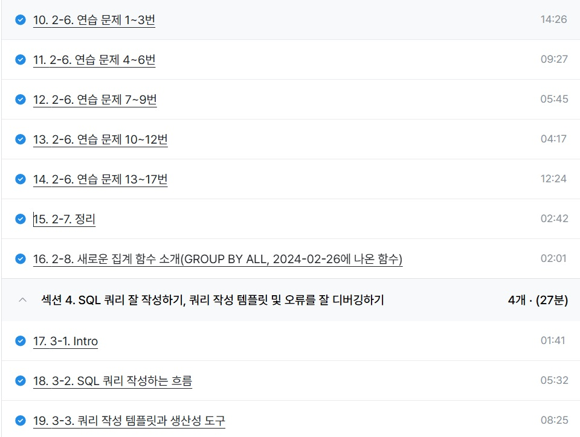

# SQL_BASIC 3주차 정규 과제 

📌SQL_BASIC 정규과제는 매주 정해진 분량의 `초보자를 위한 BigQuery(SQL) 입문` 강의를 듣고 간단한 문제를 풀면서 학습하는 것입니다. 이번주는 아래의 **SQL_Basic_3rd_TIL**에 나열된 분량을 수강하고 `학습 목표`에 맞게 공부하시면 됩니다.

**3주차 과제는 문제 풀이를 중심으로**, 강의에서 제시된 예제 문제 중 **7 문제 이상을 선택하여 직접 풀어본 뒤**, 강의 영상의 풀이와 비교해 **틀린 부분, 맞은 부분, 새롭게 배운 개념**을 구체적으로 정리해주세요. (적어도 3문제는 정리해야 합니다.) 완성된 과제는 Gihub에 업로드하고, 링크를 스프레드시트 'SQL' 시트에 입력해 제출해주세요.

**(수행 인증샷은 필수입니다.)** 

## SQL_BASIC_3rd

### 섹션 3. 데이터 탐색 - 조건, 추출, 요약

### 2-6. 연습문제 1~3번

### 2-6. 연습문제 7~9번

### 2-6. 연습문제 10~12번

### 2-6. 연습문제 13~17번

### 2-7. 정리 

### 2-8. 새로운 집계함수

## 섹션 4. 쿼리 잘 작성하기, 쿼리 작성 템플릿 및 오류를 잘 디버깅하기

### 3-1. INTRO

### 3-2. SQL 쿼리 작성하는 흐름

### 3-3. 쿼리 작성 템플릿과 생산성 도구 

## 🏁 강의 수강 (Study Schedule)

| 주차  | 공부 범위              | 완료 여부 |
| ----- | ---------------------- | --------- |
| 1주차 | 섹션 **1-1** ~ **2-2** | ✅         |
| 2주차 | 섹션 **2-3** ~ **2-5** | ✅         |
| 3주차 | 섹션 **2-6** ~ **3-3** | ✅         |
| 4주차 | 섹션 **3-4** ~ **4-4** | 🍽️         |
| 5주차 | 섹션 **4-4** ~ **4-9** | 🍽️         |
| 6주차 | 섹션 **5-1** ~ **5-7** | 🍽️         |
| 7주차 | 섹션 **6-1** ~ **6-6** | 🍽️         |

 

<!-- 여기까진 그대로 둬 주세요-->

---

# 1️⃣ 개념정리

## 2-6. 연습문제

~~~
✅ 학습 목표 :
* 연습문제(7문제 이상) 푼 것들 정리하기
~~~

문제풀때 테이블, 조건, 컬럼, 집계 써놓고 생각하면서 풀기

NULL 확인은 IS NULL 사용 <-> IS NOT NULL

WHERE에서 여러조건쓸땐 AND, OR 사용 (OR은 ( ) OR ( ) <- 이렇게사용)

내림차순 ORDER BY 컬럼 DESC

집계함수는 기준있으면 GROUP BY와 세트, 기준(컬럼)없으면 COUNT만 가능

DISTINCT는 고윳값 COUNT(DISTINCT id)처럼 사용

GROUP BY 1 = SELECT의 첫 컬럼을 의미 / 
ORDER BY에서도 가능 빠르고 간략하게 쓸때 사용

HAVING과 WHERE 차이(집계 전, 후)

HAVING이 안되면 WHERE로 서브쿼리 써서도 가능함

NAME IN (조건들) 괄호안의 조건만 있는 행추출

컬럼 LIKE는 특정단어 포함 여부

%는 엑셀에서 *와 같은역할

COUNTIF = WHERE + COUNT
## 2-8. 새로운 집계함수

~~~
✅ 학습 목표 :
* SQL 쿼리 구조를 이해할 수 있다. 
* SELECT, FROM, WHERE을 활용하는 방법을 설명할 수 있다. 
~~~

GROUP BY ALL = 컬럼안써도 되는 GROUP BY

## 3-2. 쿼리를 작성하는 흐름

~~~
✅ 학습 목표 :
* 쿼리를 작성하는 흐름을 설명할 수 있다.
~~~

쿼리작성순서 : 문제해결방법 고민 -> 지표구체화 -> 이전케이스활용 -> 쿼리작성 -> 정합성 확인(예상과 결과의 일치여부) -> 가독성개선 -> 저장(재사용대비)

## 3-3. 쿼리 작성 템플릿과 생산성 도구

~~~
✅ 학습 목표 :
* 생산성 도구를 만들 수 있다.
~~~

<!-- 이어질 주차에서 생산성 도구를 활용한 실습이 있습니다.강의에 맞게 제작하여 화면을 캡쳐하여 이 주석을 지우고 올려주세요. -->

 
 

---

# 2️⃣ 학습 인증란

  

---

# 3️⃣ 확인문제

## 문제 1

> **🧚Q. 포켓몬 게임에 재미를 느낀 동혁은 포켓몬 도감에서 강력한 포켓몬 타입을 미리 선점하기 위해, 먼저 어떤 포켓몬들이 있는지 포켓몬 수를 기준으로 내림차순 정렬하여  확인하고자 했습니다.**
>
> 그래서 다음과 같은 필요한 정보를 미리 정리해보았습니다. 

~~~
조건 : type2는 상관없이
보고 싶은 컬럼 : type1
집계 내용 : 각 type1 별 포켓몬 수
정렬 기준 : 포켓몬 수를 기준으로 내림차순 정렬
~~~

> **이 목표를 바탕으로 동혁이 아래와 같은 쿼리를 잘 작성했지만, 일부 SQL 문법 요소를 빼먹었습니다. 비어 있는 부분인 ㄱ,ㄴ,ㄷ 에 들어갈 알맞은 SQL 구문을 채워보세요:**

~~~sql
SELECT type1, (ㄱ)
FROM pokemon
(ㄴ) type1
ORDER BY (ㄱ) (ㄷ);
~~~

~~~
ㄱ - COUNT(pokemon_id) AS pokemon_cnt
ㄴ - GROUP BY
ㄷ - DESC
~~~

### 🎉 수고하셨습니다.
