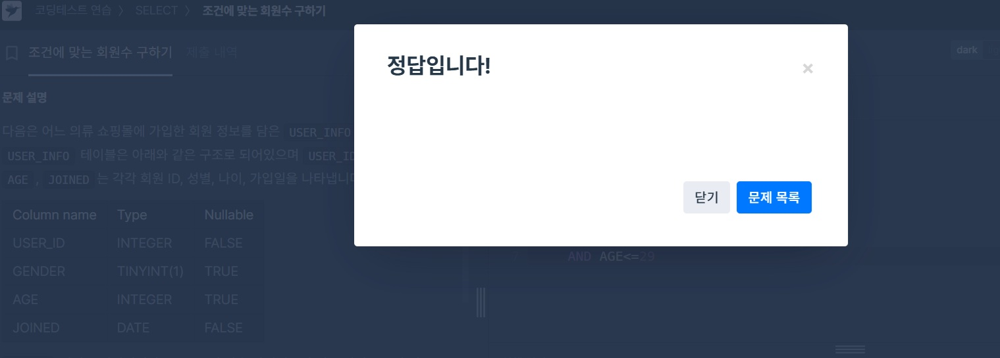
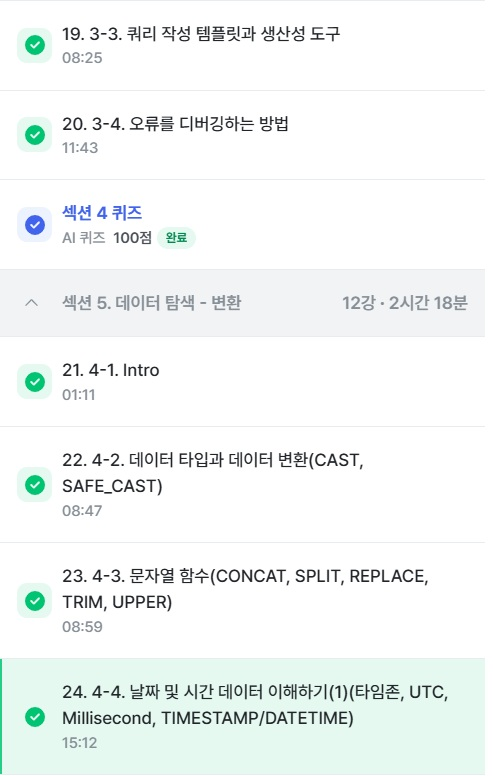

# SQL_BASIC 4주차 정규 과제 

📌SQL_BASIC 정규과제는 매주 정해진 분량의 `초보자를 위한 BigQuery(SQL) 입문` 강의를 듣고 간단한 문제를 풀면서 학습하는 것입니다. 이번주는 아래의 **SQL_Basic_4th_TIL**에 나열된 분량을 수강하고 `학습 목표`에 맞게 공부하시면 됩니다.

**4주차 과제부터는 강의 내용을 정리하는 것과 함께, 프로그래머스에서 제공하는 SQL 문제를 직접 풀어보는 실습도 병행합니다.** 강의에서는 **배운 내용을 정리하고 주요 쿼리 예제를 정리**하며, 프로그래머스 문제는 **직접 풀어본 뒤 풀이 과정과 결과, 배운 점을 함께 기록**해주세요. 완성된 과제는 Github에 업로드하고, 링크를 스프레드시트 'SQL' 시트에 입력해 제출해주세요.

**(수행 인증샷은 필수입니다.)** 

## SQL_BASIC_4th

### 섹션 4. 쿼리 잘 작성하기, 쿼리 작성 템플릿 및 오류를 잘 디버깅하기

### 3-4. 오류를 잘 디버깅하는 방법

## 섹션 5. 데이터 탐색 - 변환

### 4-1. INTRO

### 4-2. 데이터 타입과 데이터 변환(CAST, SAFE_CAST)

### 4-3. 문자열 함수(CONCAT, SPLIT, REPLACE, TRIM, UPPER)

### 4-4. 날짜 및 시간 데이터 이해하기(1) (타임존, UTC, Millisecond, TIMESTAMP/DATETIME)

## 🏁 강의 수강 (Study Schedule)

| 주차  | 공부 범위              | 완료 여부 |
| ----- | ---------------------- | --------- |
| 1주차 | 섹션 **1-1** ~ **2-2** | ✅         |
| 2주차 | 섹션 **2-3** ~ **2-5** | ✅         |
| 3주차 | 섹션 **2-6** ~ **3-3** | ✅         |
| 4주차 | 섹션 **3-4** ~ **4-4** | ✅         |
| 5주차 | 섹션 **4-4** ~ **4-9** | 🍽️         |
| 6주차 | 섹션 **5-1** ~ **5-7** | 🍽️         |
| 7주차 | 섹션 **6-1** ~ **6-6** | 🍽️         |

 

<!-- 여기까진 그대로 둬 주세요-->

---

# 1️⃣ 개념정리

## 3-4. 오류를 디버깅하는 방법

~~~
✅ 학습 목표 :
* 오류의 정의에 대해 설명할 수 있다. 
* 오류 메시지를 보고 디버깅이라는 과정을 수행할 수 있다. 
~~~

## syntax error - 문법오류
 - 해결법 - 번역, 해석후 -> 구글검색, gpt, 커뮤니티에서 해결방법 
 - [A:B]에서 A는 줄 B는 칸
 ## 에러 종류
 - must not be empty  -> SELECT 뒤가 비어있는 경우
 - does not match agg ftn COUNT -> COUNT내의 인자는 1개만
 - neither grouped nor aggregated -> SELECT 사용후 GROUP BY 사용 안한경우
 - expected end but SELECT -> 입력 완료후 SELECT 사용, 세미콜론으로 구분해주기
 - expected end but WHERE -> 마지막에 쓰는 함수(LIMIT)를 WHERE 전에 썼을때
 - expected ")" but.. -> ')' 가 예상되지만 스크립트가 끝난경우

## 4-2. 데이터 타입과 데이터 변환(CAST, SAFE_CAST)

~~~
✅ 학습 목표 :
* 데이터 타입의 종류를 설명할 수 있다. 
* 데이터 타입을 변환하는 방법을 설명할 수 있다. 
~~~
## 데이터변환
 - 숫자, 문자, 시간날짜, bool etc...
 - 데이터타입이 중요한 이유는 1이 숫자일수도 문자일수도 있음
 ### 데이터변환 함수
 - CAST - 데이터타입 변경 ex)CAST(1 AS STRING) -> 1을 문자로
 - SAFE_붙이면 변환 실패시 NULL 반환 ex)SAFE_CAST(인자)
 - 수학함수 - 암기필요x 존재만 알고있기
 - SAFE_DIVIDE(x,y)처럼 쓰면 좋음(0으로 나누면 zero error 발생)

## 4-3. 문자열 함수(CONCAT, SPLIT, REPLACE, TRIM, UPPER)

~~~
✅ 학습 목표 :
* 문자열 함수들의 종류를 이해하고 어떠한 상황에서 사용하는지 설명할 수 있다. 
~~~

## 문자열 함수
 - CONCAT - 문자열 붙이기(데이터를 직접넣어줘서 FROM 없이도 실행가능)
~~~sql
ex)
SELECT
    CONCAT("안녕", "하세요") AS result
    CONCAT(컬럼1, 컬럼2,...)
결과->안녕하세요
~~~

 - SPLIT - 문자열 쪼개기 (결과는 ARRAY형태)
~~~sql
ex)
SELECT
    SPLIT("가, 나, 다",",") AS result
    SPLIT(문자열원본, 나눌기준이 되는 문자)
결과-> 가 나 다 
~~~

 - REPLACE - 단어 수정
 ~~~sql
 SELECT
    REPLACE("안녕하세요", "안녕", "실천") AS result
    REPLACE(문자열원본, 찾을단어, 바꿀단어)
결과-> 실천하세요
 ~~~

 - TRIM - 문자열 자르기
 ~~~sql
SELECT
    TRIM("안녕하세요", "하세요") AS result
    TRIM(문자열원본, 자를단어)
결과-> 안녕
 ~~~

 - UPPER - 소문자->대문자 (Ash와 같은 대소문자 섞인 문자열을 비교,확인하기 쉽게하기 위함)
 ~~~sql
SELECT
    UPPER("abc") AS result
    UPPER(문자열 원본)
결과-> ABC
 ~~~

 ### - 정리
  - CONCAT, SPLIT, REPLACE, TRIM, UPPER
  - 붙이기, 분리하기, 수정하기, 자르기, 대문자

## 4-4. 날짜 및 시간 데이터 이해하기(1) (타임존, UTC, Millisecond, TIMESTAMP/DATETIME)

~~~
✅ 학습 목표 :
* 날짜 및 시간 데이터 타입과 UTC의 개념을 설명할 수 있다. 
* DATE, DATETIME, TIMESTAMP 에 대해서 설명할 수 있다.
* 시간함수들의 종류와 시간의 차이를 추출하는 방법을 설명할 수 있다. 
~~~

## 날짜 및 시간데이터
 - DATE : DATE만 표시 ex)2023-12-31
 - TIME : TIME만 표시 ex)23:59:59:00
 - DATETIME : DATE+TIME 표시 ex)2023-12-31 14:00:00
 - GMT : 영국기준, 한국 GMT+9
 - UTC : 국제표준, 한국 UTC+9 GMT~UTC
 - TIMESTAMP : UTC에서 지난 시간 나타내는 값 ex)2023-12-31 14:00:00 UTC
### 시간데이터 다루기
 - milisecond(ms) - 1/1000초 ms->TIMESTAMP -> DATETIME으로 변환
 - microsecond - 1/1,000,100초

~~~sql
ex)12397012ms
SELECT
    TIMESTAMP_MILLIS(12397012) AS milli_to_timestamp_value

    TIMESTAMP_MICROS(12397012000) AS milli_to_timestamp_value

    DATETIME(TIMESTAMP_MICROS(12397012000)) AS mil_to_stamp_value
    
    -> 셋이 같은결과 / 000추가된거 mili to micro
    
    DATETIME(TIMESTAMP_MICROS(12397012000), 'Asia/Seoul') AS
    mil_to_stamp_value

-> 시간정보 꼭 넣어줘야함! 국가간 시차 메꿔줌 시간대가 이상하면 점검하기
~~~

TIMESTAMP <-> DATETIME 변환 보통 DATETIME 많이씀

~~~sql
DATETIME(CURRENT_TIMESTAMP(), 'Asia/Seoul') AS datetime_col
~~~
#### TIMESTAMP vs DATETIME
 
|  | TIMESTAMP | DATETIME |
|------|------|------|
| 타임존  | UTC  | T(TIME을 의미)  |
| 시간 차이  | 한국시간-9시간  | 한국Zone사용시 한국시간과 동일  |

 

 

---

# 2️⃣ 확인문제 & 문제 인증

## 프로그래머스 문제 

> 조건에 맞는 회원 수 구하기 (SELECT, COUNT) 
>
> **먼저 문제를 풀고 난 이후에 확인 문제를 확인해주세요**
>
> 문제 링크 
>
> :  https://school.programmers.co.kr/learn/courses/30/lessons/131535#

<!-- 문제를 풀기 위하여 로그인이  필요합니다. -->

## 문제 1

> **🧚Q. 프로그래머스 문제를 풀던 서현이는 여러 번의 시행착오 끝에 결국 혼자 해결하기 어려워 오류 메시지를 공유하며 도움을 요청했습니다. 여러분들이 오류 메시지를 확인하고, 해당 SQL 쿼리에서 어떤 부분이 잘못되었는지 오류 메시지를 해석하고 찾아 설명해주세요.**

~~~sql
# 조건에 맞는 회원 수 구하기 (SELECT, COUNT) 
# 서현이의 SQL 첫 번째 풀이
SELECT COUNT(*)
FROM USER_INFO
WHERE AGE BETWEEN 20 AND 29
  AND JOINED BETWEEN '2021-01-01' AND '2021-12-31';
  
오류 메시지 : Error: Number of arguments does not match for aggregate function COUNT
 
# 수정하고 난 이후 두 번째 풀이
SELECT AGE, COUNT(*)
FROM USER_INFO
WHERE AGE BETWEEN 20 AND 29
  AND JOINED BETWEEN '2021-01-01' AND '2021-12-31';
  
오류 메시지 : SELECT list expression references column AGE which is neither grouped nor aggregated
~~~

~~~sql
첫번째 풀이 - COUNT의 인자는 1개만 들어가야함
SELECT COUNT(AGE)
FROM USER_INFO
WHERE AGE BETWEEN 20 AND 29
  AND JOINED BETWEEN '2021-01-01' AND '2021-12-31';

두번째 풀이 - COUNT를 쓰고나선 집계 or GROUP BY가 필요
SELECT AGE, COUNT(*)
FROM USER_INFO
WHERE AGE BETWEEN 20 AND 29
  AND JOINED BETWEEN '2021-01-01' AND '2021-12-31';
GROUP BY AGE
~~~

### 🎉 수고하셨습니다.