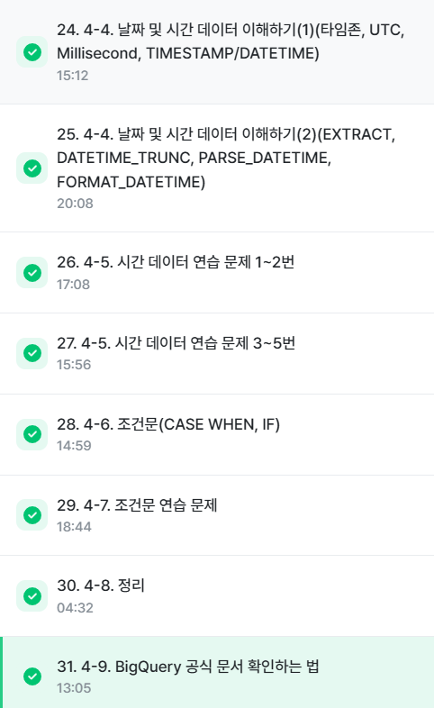

# SQL_BASIC 5주차 정규 과제 

📌SQL_BASIC 정규과제는 매주 정해진 분량의 `초보자를 위한 BigQuery(SQL) 입문` 강의를 듣고 간단한 문제를 풀면서 학습하는 것입니다. 이번주는 아래의 **SQL_Basic_5th_TIL**에 나열된 분량을 수강하고 `학습 목표`에 맞게 공부하시면 됩니다.

**5주차 과제는 문제 풀이를 중심으로**, 강의에서 제시된 예제 문제 중 **3 문제 이상을 선택하여 직접 풀어본 뒤**, 강의 영상의 풀이와 비교해 **틀린 부분, 맞은 부분, 새롭게 배운 개념**을 구체적으로 정리해주세요. (적어도 4문제는 정리해야 합니다.) 완성된 과제는 Gihub에 업로드하고, 링크를 스프레드시트 'SQL' 시트에 입력해 제출해주세요.

**(수행 인증샷은 필수입니다.)** 

## SQL_BASIC_5th

### 섹션 5. 데이터 탐색 - 변환

### 4-4. 날짜 및 시간 데이터 이해하기(2) (EXTRACT, DATETIME_TRUNC, PARSE_DATETIME, FROMAT_DATETIME)

### 4-5. 시간 데이터 연습문제 1~2번

### 4-5. 시간 데이터 연습문제 3~5번

### 4-6. 조건문 (CASE WHEN, IF)

### 4-7. 조건문 연습 문제

### 4-8. 정리

### 4-9. BigQuery 공식 문서 확인하는 법

(강의에서 연습문제가 많아서 따로 프로그래머스 문제 과제는 없습니다.)

## 🏁 강의 수강 (Study Schedule)

| 주차  | 공부 범위              | 완료 여부 |
| ----- | ---------------------- | --------- |
| 1주차 | 섹션 **1-1** ~ **2-2** | ✅         |
| 2주차 | 섹션 **2-3** ~ **2-5** | ✅         |
| 3주차 | 섹션 **2-6** ~ **3-3** | ✅         |
| 4주차 | 섹션 **3-4** ~ **4-4** | ✅         |
| 5주차 | 섹션 **4-4** ~ **4-9** | ✅         |
| 6주차 | 섹션 **5-1** ~ **5-7** | 🍽️         |
| 7주차 | 섹션 **6-1** ~ **6-6** | 🍽️         |

 

<!-- 여기까진 그대로 둬 주세요-->

---

# 4-4. 날짜 및 시간 데이터 이해하기(2) (EXTRACT, DATETIME_TRUNC, PARSE_DATETIME, FROMAT_DATETIME)

~~~
✅ 학습 목표 :
* 날짜 및 시간 데이터에 대해서 더 자세히 설명할 수 있다. 
* CURRENT_TIME, EXTRACT, DATETIME_TRUNC, PARSE_DATETIME, FROMAT_DATETIME 을 설명할 수 있다. 
~~~

CURRENT_DATETIME : 현재 DATETIME 출력
ex) CURRENT_DATE("Asia/Seoul")AS asia_date #asia_date로 현재시간 출력 
DATETIME - EXTRACT(patr FRRM datetime_expression) 
EXTRACT(DATE FROM DATETIME"2024-01-02 14:00:00")AS date  
요일 - EXTRACT(DAYOFWEEK FROM datetime_col) 1-7의 값 반환
DATE와 HOUR만 남기기 
DATETIME_TRUNC(datetime_col, DAY/YEAR/MONTH/HOUR) 일자/연도/월/일만 자르기 
DATE가 문자열로 저장된 경우가 있으므로 유의할것 
PARSE_DATETIME('%Y-%m-%d %H:%M:%S', '2024-01-11 12:35:35') AS parse_datetime; 
FORMAT_DATETIME("%c", DATETIME "2024-01-11 12:35:35") AS formatted; 
LAST_DAY(DATETIME '2024-01-03 15:30:00') AS last_day
DATETIME_DIFF(first_datetime, second_datetime, DAY/MONTH/WEEK) AS day_diff1

EXTRACT <-> DATETIME_TRUNC 2024-01-01 T00:00:00 에서 T이 필요한지 생각해보기 TRUNC는 시간을짜를때

대표적인거만 외우고 필요할때 찾기, 자주사용하는거 저장해두기
# 4-6. 조건문(CASE WHEN, IF)

~~~
✅ 학습 목표 :
* 조건문 함수의 기능을 이해하고, 설명할 수 있다. 
~~~
조건문
CASE WHEN 조건많을때
SELECT
    CASE
    WHEN 조건1 THEN 조건1이 참일경우
    WHEN 조건2 THEN 조건2가 참일경우
    ELSE 그 외 조건일경우
END AS 새로운 컬럼이름

CASE WHEN순서 유의! 첫번째 조건이 먼저 걸림 
둘다 적용되면 앞에조건에 걸림

IF 단일조건에서 유용
SELECT
    IF(1=1, '동일한결과', '동일하지 않은 결과') AS result1

 # 4-5. 시간 데이터 연습문제 & 4-7. 조건문 연습 문제

~~~
✅ 학습 목표 :
* 4-5, 4-7 각각에서 두 문제 이상 (최소 4문제) 푼 내용 정리하기
~~~

항상 데이터확인하기! 

1. 배틀이 일어난 시간(battle_datetime)을 기준으로 오전 6시에서 오후 6시 사이에 일어난 배틀의 수를 계산해주세요
SELECT
    id,
    battle_datetime,
    DATETIME(battle_timestamp, 'Asia/Seoul') AS battle_timestamp_kr,
    COUNTIF(battle_datetime = DATETIME(battle_timestamp, "Asia/Seoul")) AS battle_datetime_same_battle_timestamp_kr
FROM basic.battle

SELECT
    COUNT(DISTINCT id) AS battle
FROM basic.battle
WHERE
    EXTRACT(HOURT FROM  battle_datetime) >= 6
    AND EXTRACT(HOUR FROM battle_datetime) <= 18
EXTRACT(HOUR FROM battle_datetime) BETWEEN 6 and 17

2. 각 트레이너별로 그들이 포켓몬을 포획한 첫 날(catch_date)을 찾고, 그 날짜를 'DD/MM/YYYY' 형식으로 출력해주세요.

SELECT
    trainer_id,
    FORMAT_DATE("%d%n%Y", min_catch_date) AS new_min_catch_date
FROM(
    SELECT
    trainer_id,
    MIN(DATE(catch_datetime, "Asia/Seoul")) AS min_catch_date
FROM  basic.trainer_pokemon
GROUP BY
    trainer_id
)
ORDER BY
    trainer_id

3. 각 포켓몬의 총점(total)을 기준으로 300이하면 Low, 301에서 500사이면 medium, 501이상이면 high로 분류
SELECT
    id,
    kor_name,
    total,
    CASE
        WHEN total >= 500 THEN "High"
        WHEN total BETWEEN 300 AND 500 THEN "Medium"
    ELSE "Low"
    END AD total_grade
FROM basic.pokemon
WHERE
    total_grade = "Low"

4. 각 트레이너의 배지개수를 기준으로 5개이하면 Beginner, 6개에서 8개사이 intermediate 그이상 advanced

SELECT
    id,
    name,
    badge_count,
    CASE
        WHEN badge_count >=9 THEN "Advanced"
        WHEN badge_count BETWEEN 6 AND 8 THEN "Intermediate"
    ELSE "Beginner"
    END AS trainer_level
FROM basic.trainer
GROUP BY
    trainer_level

 

 

---

# 확인문제

## 문제 1

> **🧚Q. 광윤이는 사용자 로그 데이터에서, 2021년에 접속한 사용자 수를  집계하려고 했습니다. 그는 여러 SQL 쿼리들을 실행해봤지만, 그 중 일부는 문법적으로 잘못되어 실행되지 않았습니다. 다음 보기 중 틀린 쿼리를 모두 골라보세요 (복수 선택 가능)**

~~~sql
1. SELECT COUNT(*)  
   FROM user_log  
   WHERE EXTRACT(YEAR FROM login_date) = 2021;

2. SELECT EXTRACT(YEAR FROM login_date), COUNT(*)  
   FROM user_log  
   GROUP BY EXTRACT(YEAR FROM login_date);

3. SELECT COUNT(*)  
   FROM user_log  
   WHERE login_date = '2021';

4. SELECT COUNT(*)  
   FROM user_log  
   WHERE login_date BETWEEN '2021-01-01' AND '2021-12-31';
~~~

<!-- 틀린쿼리에 대한 오류의 원인도 같이 작성해주세요. 문제에서 제공된 login_data 컬럼은 DATE type의 데이터를 가지고 있다고 가정하시면 됩니다. -->

~~~
SELECT COUNT(*)  
FROM user_log  
WHERE login_date = '2021';

DATE타입이라 직접비교할수없어 EXTRACT를 사용해야합니다
~~~

## 문제 2

> **🧚Q. 혜성이는 포켓몬 타입에 따라 설명을 부여하는 쿼리를 작성했습니다. type 1 컬럼의 값에 따라 조건을 분기했으며, 다음 SQL 쿼리를 실행했습니다.**

~~~sql
SELECT name,
       CASE 
         WHEN type1 = 'Fire' THEN 'Hot'
         WHEN type1 = 'Water' THEN 'Cool'
         ELSE 'Normal'
       END AS type_description
FROM pokemon;
~~~

> **다음 중 type_description의 결과가 'Normal'로 출력될 포켓몬은?**

| **name**   | **type1** |
| ---------- | --------- |
| Pikachu    | Electric  |
| Charmander | Fire      |
| Squirtle   | Water     |
| Bulbasaur  | Grass     |

<!-- 근거와 함께 답을 작성해주세요 -->

~~~
Pikachu, Bulbasaur

FIRE는 HOT, WATER는 COOL 그외는 NORMAL이므로 NORMAL타입이 출력됨
~~~

 

### 🎉 수고하셨습니다.