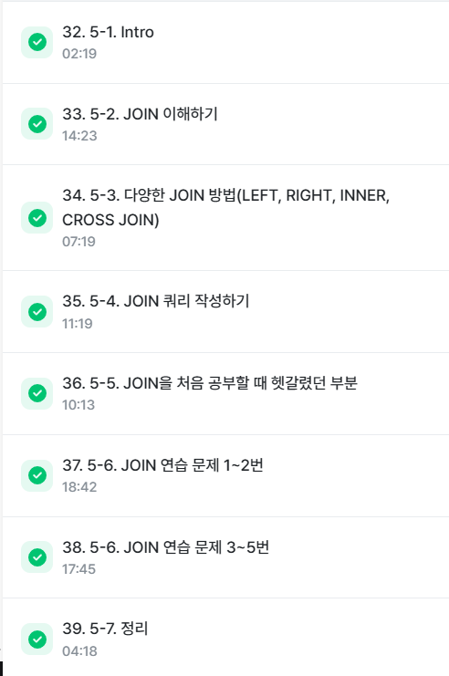
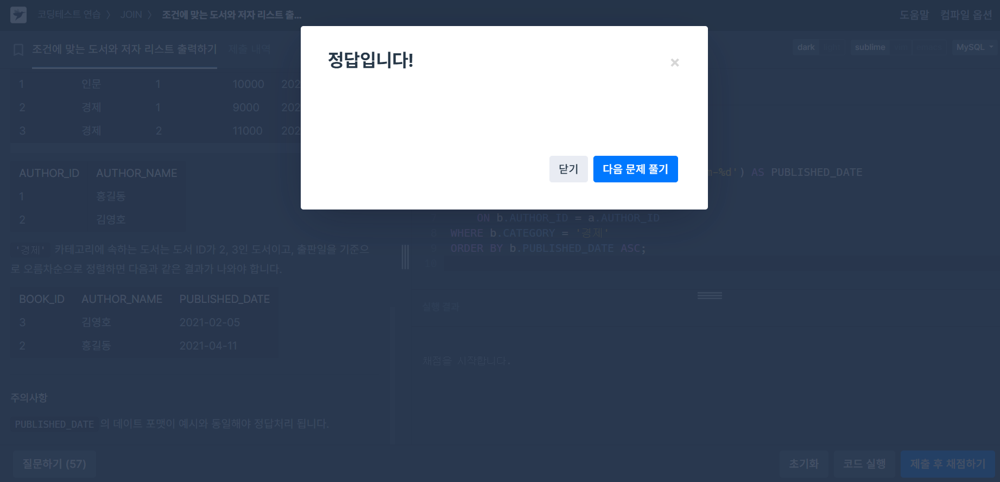

# SQL_BASIC 6주차 정규 과제 

📌SQL_BASIC 정규과제는 매주 정해진 분량의 `초보자를 위한 BigQuery(SQL) 입문` 강의를 듣고 간단한 문제를 풀면서 학습하는 것입니다. 이번주는 아래의 **SQL_Basic_6th_TIL**에 나열된 분량을 수강하고 `학습 목표`에 맞게 공부하시면 됩니다.

**6주차 과제는 강의 내용을 정리하는 것과 함께, 프로그래머스에서 제공하는 SQL 문제를 직접 풀어보는 실습도 병행합니다.** 강의에서는 **배운 내용을 정리하고 주요 쿼리 예제를 정리**하며, 프로그래머스 문제는 **직접 풀어본 뒤 풀이 과정과 결과, 배운 점을 함께 기록**해주세요. 완성된 과제는 Github에 업로드하고, 링크를 스프레드시트 'SQL' 시트에 입력해 제출해주세요.

**(수행 인증샷은 필수입니다.)** 

## SQL_BASIC_6th

### 섹션 6. 다량의 자료를 연결 : JOIN 

### 5-1. Intro

### 5-2. JOIN 이해하기

### 5-3. 다양한 JOIN 방법

### 5-4. JOIN 쿼리 작성하기 

### 5-5. JOIN을 처음 공부할 때 헷갈렸던 부분

### 5-6. JOIN 연습문제 1~2번

### 5-6. JOIN 연습문제 3~5번

### 5-7. 정리


## 🏁 강의 수강 (Study Schedule)

| 주차  | 공부 범위              | 완료 여부 |
| ----- | ---------------------- | --------- |
| 1주차 | 섹션 **1-1** ~ **2-2** | ✅         |
| 2주차 | 섹션 **2-3** ~ **2-5** | ✅         |
| 3주차 | 섹션 **2-6** ~ **3-3** | ✅         |
| 4주차 | 섹션 **3-4** ~ **4-4** | ✅         |
| 5주차 | 섹션 **4-4** ~ **4-9** | ✅         |
| 6주차 | 섹션 **5-1** ~ **5-7** | ✅         |
| 7주차 | 섹션 **6-1** ~ **6-6** | 🍽️         |

<!-- 여기까진 그대로 둬 주세요-->

<br>

---

# 1️⃣ 개념정리

## 5-2. JOIN 이해하기

~~~
✅ 학습 목표 :
* JOIN에 대한 정의와 필요성에 대해 설명할 수 있다.
~~~

두 데이터를 연결할 수 있는 공통 컬럼(key)을 통해 다른 데이터테이블을 연결해주는것, 특정범위로도 가능함
left join의 개념과 유사
Key = trainer_id, id처럼
테이블조인의 제한은 없다

테이블의 저장된 형태를 꼭 봐라


JOIN의 이유 - 정규화(중복최소화)하도록 데이터 구조화해서 따로따로 있음 그래서 사용할땐 붙여서 사용해야함

데이터분석은 합쳐져있는게 좋고 개발 관점은 분리가 좋음 따라서 최근엔 데이터웨어하우스에서 JOIN을 사용해 데이터마트를 만든다(가공도 할수있음)
## 5-3. 다양한 JOIN 방법

~~~
✅ 학습 목표 :
* JOIN 방법들의 종류를 설명할 수 있다. 
* 각 JOIN 방법들의 차이점에 대해서 설명할 수 있다. 
~~~

LEFT JOIN이 가장중요
A / B 테이블이 있다고 가정했을때
INNER JOIN은 교집합
LEFT JOIN은 A테이블 기준으로 B테이블을 붙임
RIGHT JOIN은 B테이블 기준으로 A를 붙임
FULL JOIN은 합집합 빈칸은 NULL
CROSS JOIN은 가능한 경우에수대로 모두 곱해줌 따라서 데이터가 매우많아져 주필요


## 5-4. JOIN 쿼리 작성하기 

~~~
✅ 학습 목표 :
* JOIN을 사용한 문법에 대해 이해하여 적용할 수 있다.
* JOIN 을 활용한 쿼리를 작성할 수 있다. 
~~~

테이블 확인(데이터) -> 기준 테이블 정의 -> JOIN Key 찾기 -> 결과 예상 -> 쿼리작성/검증
EX) SELECT
        A.col1,
        A.col2,
        B.col1,
        B.col2
    FROM table1 AS A
    LEFT JOIN table2 AS B
    ON A.key = B.key

하려는 작업의 목적에 따라 JOIN 선택하기
LEFT JOIN을 주로 사용하고, 기준이 되는 Table을 왼쪽에 두고 오른쪽에 계속 추가
컬럼또한 데이터에 필요한정도만 선택하는게 비용을 줄이기 좋다
ID같은 경우는 unique여부 확인을 위해 갖고다니는걸 추천


## 5-6. JOIN 연습문제 1~5번 

~~~
✅ 학습 목표 :
* 연습문제(3문제 이상) 푼 것들 정리하기
~~~
2. 각 트레이너가 가진 포켓몬 중에서 'Grass'타입의 포켓몬 수를 계산해주세요 (type1 기준)
```sql
SELECT
    tp.*,
    p.type1
    
FROM()
    SELECT
        id,
        trainer_id,
        pokemon_id,
        status
    FROM trainer_pokemon
WHERE
    status IN("Active", "Training")
) AS tp
LEFT JOIN basic.pokemon AS p
ON tp.pokemon_id = p.id
WHERE 
type1 = "Grass"
GROUP BY
type1
ORDER BY
2 DESC
```

3. 트레이너의 고향과 포켓몬 포획위치 비교해 교향에서 포켓몬 포획트레이너수 계산
```SQL
SELECT
    COUNT(DISTINCT tp.trainer_id) AS trainer_uniq,
    COUNT(tp.trainer_id) AS trainer_cnt,
FROM basic.trainer AS t
LEFT JOIN basic.trainer_pokemon AS tp
ON t.id = tp.trainer_Id
WHERE
    tp.location IS NOT NULL
    AND t.hometown = tp.location

```


<br>

<br>

---





# 2️⃣ 확인문제 & 문제 인증

## 프로그래머스 문제 

https://school.programmers.co.kr/learn/courses/30/lessons/164673

> 조건에 부합하는 중고거래 댓글 조회하기 (JOIN)

https://school.programmers.co.kr/learn/courses/30/lessons/144854

> 조건에 맞는 도서와 저자 리스트 출력하기 (JOIN)

<!-- 정답을 맞추게 되면, 정답입니다. 이 부분을 캡처해서 이 주석을 지우시고 첨부해주시면 됩니다. --> 


---

# 3️⃣ 참고자료

JOIN 에 대해서 그림으로 쉽게 이해할 수 있는 자료들도 있어서 첨부합니다. 아래의 블로그도 학습할 때 같이 참고해주세요.

1. https://data-marketing-bk.tistory.com/entry/SQL-JOIN-%ED%95%9C-%EB%B0%A9%EC%97%90-%EC%A0%95%EB%A6%AC-%EA%B0%9C%EB%85%90%EB%B6%80%ED%84%B0-%EC%BD%94%EB%93%9C%EA%B9%8C%EC%A7%80-%EC%9D%B4%EA%B2%83%EB%A7%8C-%EB%B3%B4%EC%9E%90


2. https://velog.io/@wijoonwu/JOIN

<br>

### 🎉 수고하셨습니다.
