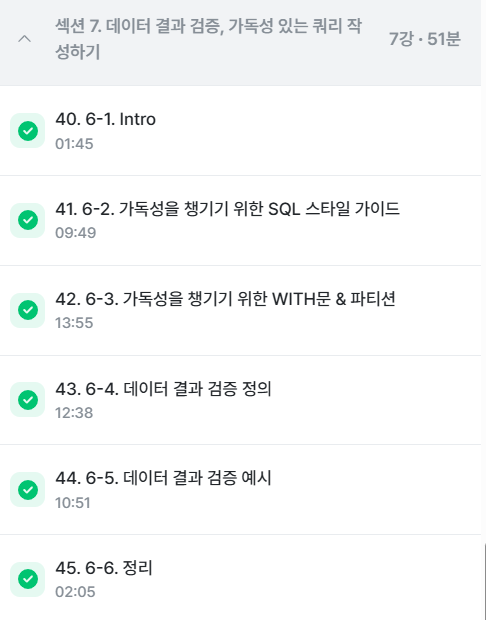
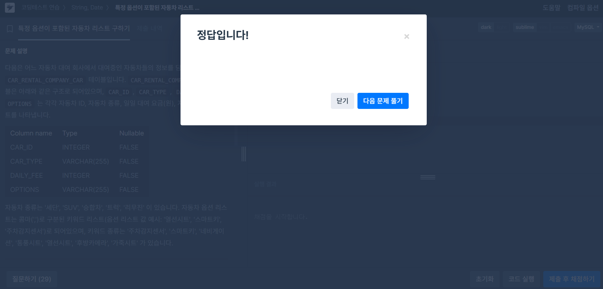
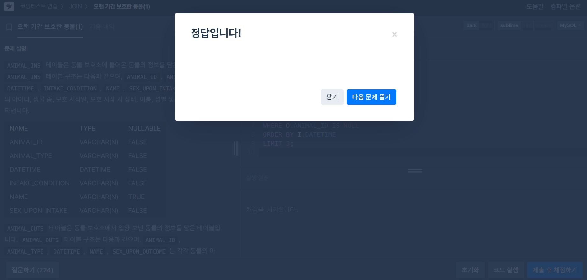
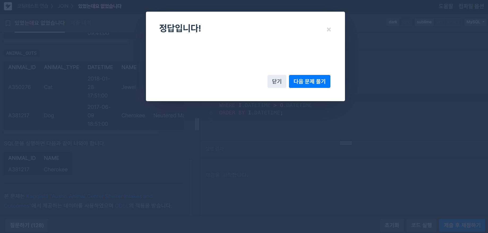
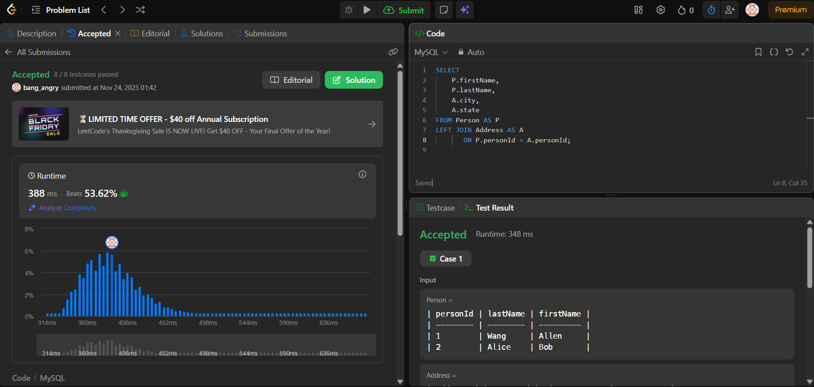
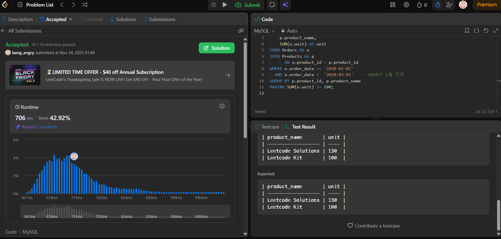

# SQL_BASIC 7주차 정규 과제 

📌SQL_BASIC 정규과제는 매주 정해진 분량의 `초보자를 위한 BigQuery(SQL) 입문` 강의를 듣고 간단한 문제를 풀면서 학습하는 것입니다. 이번주는 아래의 **SQL_Basic_7th_TIL**에 나열된 분량을 수강하고 `학습 목표`에 맞게 공부하시면 됩니다.

**7주차 과제는 강의 내용을 정리하는 것과 함께, 프로그래머스에서 제공하는 SQL 문제를 직접 풀어보는 실습도 병행합니다.** 강의에서는 **배운 내용을 정리하고 주요 쿼리 예제를 정리**하며, 프로그래머스 문제는 **직접 풀어본 뒤 풀이 과정과 결과, 배운 점을 함께 기록**해주세요. 완성된 과제는 Github에 업로드하고, 링크를 스프레드시트 'SQL' 시트에 입력해 제출해주세요.

**(수행 인증샷은 필수입니다.)** 

**(마지막 주차입니다. 조금만 더 힘내주세요~!!!)**

## SQL_BASIC_7th

### 섹션 7 데이터 결과 검증, 가독성 있는 쿼리 작성하기

### 6-1. Intro

### 6-2. 가독성을 챙기기 위한 SQL 스타일 가이드

### 6-3. 가독성을 챙기기 위한 WITH 문 & 파티션

### 6-4. 데이터 결과 검증 정의

### 6-5. 데이터 결과 검증 예시

### 6-6. 정리 

## 🏁 강의 수강 (Study Schedule)

| 주차  | 공부 범위              | 완료 여부 |
| ----- | ---------------------- | --------- |
| 1주차 | 섹션 **1-1** ~ **2-2** | ✅         |
| 2주차 | 섹션 **2-3** ~ **2-5** | ✅         |
| 3주차 | 섹션 **2-6** ~ **3-3** | ✅         |
| 4주차 | 섹션 **3-4** ~ **4-4** | ✅         |
| 5주차 | 섹션 **4-4** ~ **4-9** | ✅         |
| 6주차 | 섹션 **5-1** ~ **5-7** | ✅         |
| 7주차 | 섹션 **6-1** ~ **6-6** | ✅         |

 

<!-- 여기까진 그대로 둬 주세요-->

---

# 1️⃣ 개념정리

## 6-2. 가독성을 챙기기 위한 SQL 스타일 가이드

~~~
✅ 학습 목표 :
* 데이터 결과 검증하기 전에 실수가 발생하는 원인을 설명할 수 있다.
* SQL 쿼리를 가독성 있게 작성할 수 있다. 
~~~

SQL스타일 가이드가 있음
1. 예약어는 대문자로
2. 컬럼명은 snake or camel case가 있음 디폴트는 snake가 더 좋아보임
3. 테이블명은 명시적인게 좋다
4. 왼쪽정렬이 기본
5. 예약어나 컬럼은 한줄에 하나 권장
6. 쉼표는 컬럼 바로 뒤에

## 6-3. 가독성을 챙기기 위한 WITH문 & 파티션

~~~
✅ 학습 목표 :
* SQL 쿼리를 가독성 있게 작성할 수 있다. 
* WITH문과 파티션을 활용해서도 가독성을 챙길 수 있다. 
~~~

### 1. 반복되는 쿼리로 인한 문제점
- 동일한 로직이 여러 곳에 반복되면 **수정 시 모든 부분을 일일이 바꿔야 함**  
- 중복 코드가 많아질수록 **오류 발생 가능성 증가**  
- 전체 쿼리가 복잡해져 **가독성 저하**

---

### 2. 해결책: `WITH` 문(CTE) 사용
반복되는 하위 쿼리를 `WITH` 절로 묶으면 한 번 정의해서 재사용할 수 있음.

### 🔹 장점
- **가독성 ↑** (쿼리 구조가 깔끔해짐)
- **유지보수성 ↑** (한 줄만 수정하면 전체 반영)
- **중복 제거**로 쿼리 길이 감소
- 복잡한 로직을 단계별로 나눠서 보기 쉬움

---

### 3. 성능 및 비용 관점: `PARTITION BY` 사용
`PARTITION BY`는 윈도우 함수에서 특정 그룹 기준으로 연산을 수행할 수 있게 함.

- 별도의 서브쿼리를 반복 계산하는 것보다 **탐색 비용절감**
- 불필요한 조인이나 중첩쿼리를 줄여 **쿼리 성능 향상**
- 데이터 증가 시에도 관리가 편하고 비용 절감 가능  
  → 탐색 비용도 결국 돈이다

---

### 4. 요약
- 반복 로직 많음 → 헷갈림 + 수정 어렵고 오류 증가
- **WITH(CTE)** 로 공통 로직을 정의해 깔끔하게 재사용
- **PARTITION BY** 로 성능 최적화 및 탐색 비용 절감
- 결과적으로 **쿼리 성능↑, 유지보수성↑, 비용↓**

## 6-4. 데이터 결과 검증 정의 

~~~
✅ 학습 목표 :
* 데이터 결과 검증이 어떤 과정인지 설명할 수 있다. 
* 데이터 결과 검증에 대한 예시를 이해할 수 있다.  
~~~

# SQL 실수 줄이는 방법 & 검증 절차 정리

## 1. 왜 반복되면 문제가 되는가?
- 동일 로직을 여러 쿼리에 반복하면 **실수 확률 증가**
- 한 부분을 수정하면 **모든 반복 구간을 다시 수정해야 함**
- 참값(True Value)과 예상값(Expected Value)의 불일치가 발생하기 쉬움
- 특수성(Edge case), 도메인 지식이 충분하지 않으면 오류가 누적됨

---

## 2. 문제 해결의 핵심: “정확한 문제 정의”
### 문제정의 → Input/Output 설계 → 쿼리 작성 → 결과 검증
1) **문제정의 (구체적으로)**  
- 무엇을 계산해야 하는지  
- 어떤 기준과 조건이 필요한지  
- 포함/제외 요소 명확히 하기

2) **Input/Output 설계 (중간결과 포함)**  
- 최종 Output만 보지 말고  
  “중간 단계 Output은 어떻게 생겨야 하는가?”  
  를 반드시 미리 정의

3) **쿼리 작성 (가독성 중심)**  
- WITH 문 사용  
- 컬럼명 명확히 정의  
- 중복 계산은 한 번만

4) **결과 비교 및 검증**  
- 참값 vs 계산값 일치 여부 확인  
- 예상한 수치와 실제 결과가 맞는지 비교

---

## 3. 쿼리 정확도 높이는 체크리스트

###  COUNT(*)
- 전체 행 수가 예상과 맞는지 확인  
- 필터를 걸기 전/후로 비교

###  NOT NULL 체크

 

 

---

# 2️⃣ 확인문제 & 문제 인증

## 프로그래머스 문제 

https://school.programmers.co.kr/learn/courses/30/lessons/157343

> 특정 옵션이 포함된 자동차 리스트 구하기

https://school.programmers.co.kr/learn/courses/30/lessons/59044

> 오랜 기간 보호한 동물(1) 

https://school.programmers.co.kr/learn/courses/30/lessons/59043

> 있었는데요 없었습니다.

## LeetCode 문제

https://leetcode.com/problems/combine-two-tables/description/

> 175. Combine Two Tables

https://leetcode.com/problems/list-the-products-ordered-in-a-period/

> 1327. List the Products Ordered in a Period

<!-- 정답을 맞추게 되면, 정답입니다. 이 부분을 캡처해서 이 주석을 지우시고 첨부해주시면 됩니다. --> 

## 문제 1

> **🧚예운이는 다음 SQL 쿼리를 다트비 정규과제에 제출했다. 제출한 쿼리는 다음과 같고, 이 쿼리는 에러 메시지 없이 잘 수행하는 쿼리이다.**

~~~sql
# 주영이가 작성한 가독성 나쁜 SQL 

select u.name , o.OrderID
, p.ProductName ,od.Quantity ,od.UnitPrice 	from Users u	join Orders o on u.id = o.userId
join OrderDetails od on o.OrderID = od.orderID	join Products p on od.ProductID = p.ProductID
where u.region= 'Busan'			order by o.OrderID
~~~

> **이에 과제를 검사하던 정우는 작성한 SQL을 보고 코드 리뷰를 진행하려고 했지만, 다음 쿼리를 보고 예운이에게 질문을 하였다. "예운아, 이 쿼리 가독성이 좀 안 좋은데 내가 고쳐도 괜찮을까? 가독성 좋게 SQL 가이드에 따라 정리해보려고 해"**
>
> 다음 SQL 쿼리를 **가독성 좋은 스타일로 다시 작성해보세요.** 

~~~
-- 가독성 좋게 정리한 SQL

SELECT 
    u.name AS user_name,
    o.OrderID,
    p.ProductName,
    od.Quantity,
    od.UnitPrice
FROM Users AS u
    JOIN Orders AS o
        ON u.id = o.userId
    JOIN OrderDetails AS od
        ON o.OrderID = od.orderID
    JOIN Products AS p
        ON od.ProductID = p.ProductID
WHERE u.region = 'Busan'
ORDER BY o.OrderID;

~~~

 

 

<!-- 이렇게 SQL BASIC 과제가 마무리되었습니다. SQL은 범위가 넓고 처음 접할 때 어렵게 느껴지는 학문이지만, 이번 기수에서는 지난 기수에도 활용했던 인프런 무료 강의를 통해 기초를 탄탄히 다질 수 있도록 구성했습니다. 환경 세팅 과정이 다소 복잡했을 수도 있지만, 이번 과제를 통해 기본적인 쿼리 작성과 SELECT 명령어의 개념을 충분히 익혔을 거라 생각합니다. BASIC을 통해 데이터를 추출하는 기초를 다졌으면, 이제 ADVANCED 트랙에서 실무에 맞게 더 복잡한 문접과 분석 쿼리, 그리고 MASTER 트랙에서 실제 데이터베이스를 다루는 실무 명령어까지 배워갈 수 있습니다. 앞으로의 SQL 학습에도 화이팅이고, 부족한 템플릿이었지만 끝까지 함께해줘서 진심으로 감사드립니다.  -->

### 🎉 수고하셨습니다.
